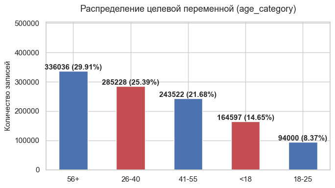
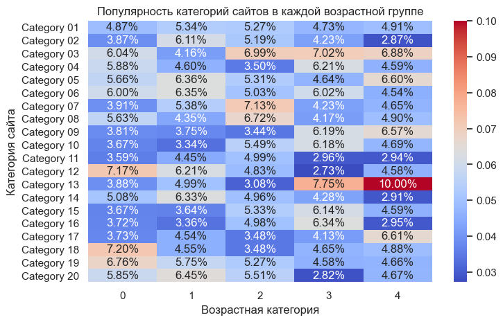
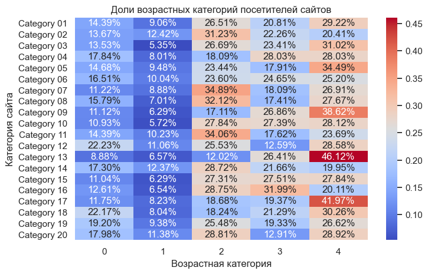
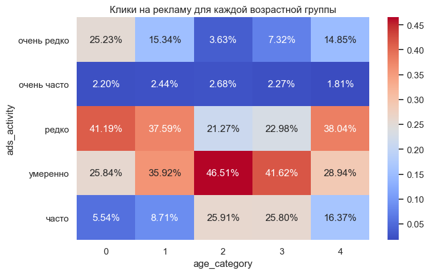
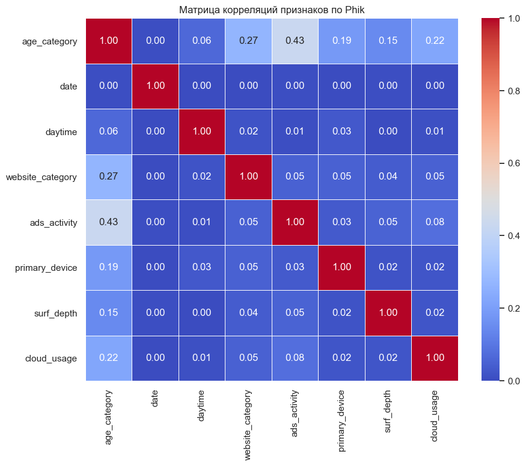
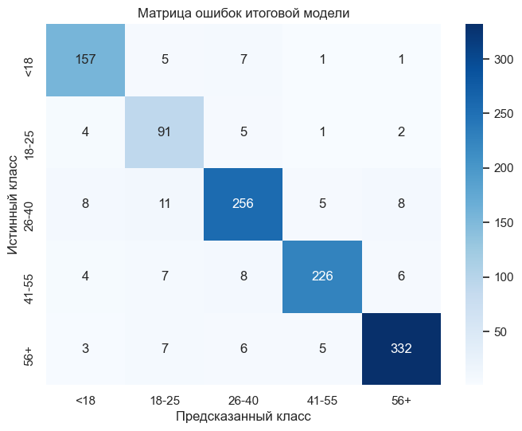

# Классификация пользователей по возрастным группам

Проект по разработке модели машинного обучения для определения примерной возрастной категории пользователя на основе его поведения в цифровой среде.

Модель может использоваться для возрастного таргетинга рекламных кампаний и повышения релевантности рекомендаций. Отдельное значение имеет корректное определение пользователей младше 18 лет для снижения риска показа несовершеннолетним рекламы, не соответствующей их возрастной категории.

## Цель проекта

Разработать модель многоклассовой классификации, способную относить пользователей интернет-сервисов к соответствующим возрастным сегментам на основе их цифрового поведения.

Основная метрика качества - **macro-F1**. Целевое значение для рекомендации модели к дальнейшему использованию — не менее **0.75**.

Дополнительно оцениваются:

* macro-precision;
* macro-recall;
* recall по отдельным возрастным категориям;
* матрица ошибок.

Особое внимание уделяется полноте определения пользователей младше 18 лет.

## Данные

Исходные данные были представлены шестью таблицами, содержащими информацию о пользователях и их активности в цифровой среде.

После объединения источников использовались следующие группы данных:

* уникальный идентификатор пользователя;
* возрастная категория пользователя - целевая переменная;
* дата посещения сайта;
* анонимизированное время посещения;
* уникальный идентификатор сессии;
* анонимизированная категория сайта;
* данные о взаимодействии с рекламой;
* информация об используемых устройствах.

Исходные данные содержали записи отдельных событий. В процессе работы они были агрегированы до уровня пользователя: **одна строка итогового признакового пространства соответствует одному уникальному пользователю**.

## Используемые технологии

**Язык и работа с данными:**

* Python
* pandas
* NumPy

**Машинное обучение:**

* scikit-learn
* LogisticRegression
* SVC
* DummyClassifier
* SelectFromModel

**Анализ и визуализация:**

* Matplotlib
* Seaborn
* PhiK
* SciPy

**Дополнительно:**

* Joblib
* JSON
* pathlib
* Jupyter Notebook

## Этапы работы

### 1. Подготовка данных

* загрузка исходных таблиц;
* изучение структуры данных;
* объединение источников;
* анализ пропусков и дубликатов;
* исследование числовых и категориальных признаков.

### 2. Исследовательский анализ данных

Проведён анализ:

* распределения целевой переменной;
* активности пользователей разных возрастных категорий;
* популярности категорий сайтов;
* взаимодействия пользователей с рекламой;
* особенностей поведения различных возрастных групп;
* связей между признаками с использованием **PhiK**.

### 3. Построение baseline

В качестве отправной точки использовались:

* `DummyClassifier`;
* базовая `LogisticRegression`.

Baseline позволил оценить, насколько дальнейший feature engineering и использование более сложных моделей улучшают качество классификации.

### 4. Feature Engineering

Ключевым этапом проекта стал переход от отдельных событий к пользовательскому уровню данных.

Для каждого пользователя были сформированы признаки, характеризующие:

* интенсивность активности;
* регулярность посещений;
* распределение активности по времени суток;
* распределение активности по дням недели;
* посещаемые категории сайтов;
* разнообразие интересов;
* особенности взаимодействия с рекламой;
* используемые устройства;
* другие агрегированные характеристики цифрового поведения.

После feature engineering одна строка набора данных стала соответствовать одному пользователю.

### 5. Предобработка данных

Был реализован единый pipeline предобработки, включающий необходимые преобразования признаков перед обучением модели.

Использование pipeline позволило выполнять одинаковую обработку данных как при обучении, так и при последующем применении модели.

### 6. Отбор признаков

Для сокращения размерности использовался `SelectFromModel` на основе `LogisticRegression` с **L1-регуляризацией**.

Отбор признаков позволил сохранить наиболее информативную часть из **92 признаков**, сформированных после этапа предобработки.

### 7. Обучение и подбор гиперпараметров

Были исследованы различные модели и конфигурации их гиперпараметров.

Лучшее качество показал pipeline:

**предобработка → отбор признаков → SVC с RBF-ядром**

Для итоговой модели использовались:

```text
SVC:
C = 1.0
gamma = 'scale'
class_weight = 'balanced'

SelectFromModel / LogisticRegression:
C = 0.3
threshold = 'median'
```

### 8. Оценка итоговой модели

Финальная модель была оценена с помощью кросс-валидации и отдельно проверена на отложенной тестовой выборке.

После этого были подготовлены артефакты, необходимые для дальнейшего использования модели.

## Основные результаты

### Влияние Feature Engineering

Наиболее значительное улучшение качества было достигнуто после перехода от отдельных записей о посещениях к агрегированному представлению данных на уровне пользователя.

Создание признаков, описывающих активность, интересы и поведенческие характеристики пользователя, существенно повысило качество всех рассматриваемых моделей.

### Отбор признаков

До применения отбора признаков модель `SVC` с RBF-ядром показывала:

**macro-F1 = 0.8783**

После применения `SelectFromModel`:

**macro-F1 = 0.8980**

Таким образом, удаление менее информативных признаков позволило дополнительно улучшить качество модели.

### Подбор гиперпараметров

После настройки итогового pipeline значение macro-F1 на кросс-валидации составило:

**0.9017**

Лучшей конфигурацией стала модель `SVC` с RBF-ядром и предварительным отбором признаков.

### Результаты на тестовой выборке

| Метрика                                |   Значение |
| -------------------------------------- | ---------: |
| Macro F1                               | **0.8972** |
| Macro Precision                        | **0.8906** |
| Macro Recall                           | **0.9063** |
| Recall для пользователей младше 18 лет | **≈ 0.92** |

Целевое значение `macro-F1 ≥ 0.75` было превышено примерно на **0.15**.

Близкие результаты на кросс-валидации и отложенной тестовой выборке указывают на стабильность качества модели на рассмотренных данных и отсутствие выраженного переобучения.

Особенно важным для бизнес-задачи является значение recall около **0.92** для пользователей младше 18 лет: модель обнаруживает большую часть пользователей этой возрастной категории.

## Визуализации

### Распределение целевой переменной



Распределение пользователей между возрастными категориями используется для оценки баланса классов и выбора подходящих метрик качества.

### Популярность категорий сайтов среди возрастных групп



Анализ позволяет увидеть различия в интересах пользователей различных возрастных категорий.

### Возрастная структура аудитории различных категорий сайтов



Визуализация показывает, какие возрастные группы формируют аудиторию различных типов сайтов.

### Взаимодействие возрастных групп с рекламой



Исследованы различия в активности пользователей разных возрастных категорий относительно рекламных объявлений.

### Матрица связей PhiK



PhiK использовался для исследования связей между признаками различных типов.

### Матрица ошибок итоговой модели



Матрица ошибок позволяет оценить, какие возрастные категории модель различает наиболее уверенно и между какими классами чаще происходят ошибки классификации.

## Итог

В рамках проекта была разработана модель многоклассовой классификации пользователей по возрастным сегментам на основе их цифрового поведения.

Ключевым фактором качества оказался **feature engineering**: агрегация событий до уровня пользователя и создание поведенческих признаков позволили значительно улучшить результаты по сравнению с базовыми моделями.

Лучший результат показал pipeline с:

**Feature Engineering → Preprocessing → SelectFromModel → SVC (RBF)**

Итоговая модель достигла:

**macro-F1 = 0.8972 на тестовой выборке**

при целевом значении **0.75**.

Полученное качество позволяет рассматривать модель как основу для дальнейшей проверки в условиях реального применения. При этом перед внедрением потребуется дополнительно оценить её работу на новых данных, устойчивость к изменению пользовательского поведения и влияние ошибок классификации на бизнес-процессы.

## Практическое применение

Модель может использоваться как один из компонентов систем:

* возрастного таргетинга рекламы;
* персонализации контента;
* формирования рекомендаций;
* сегментации аудитории;
* ограничения показа возрастно-чувствительного рекламного контента.

Для практического применения особенно важно учитывать стоимость ошибок между различными возрастными категориями. Например, ошибочная классификация несовершеннолетнего пользователя как взрослого может иметь более серьёзные последствия, чем ошибка между двумя взрослыми возрастными сегментами.

